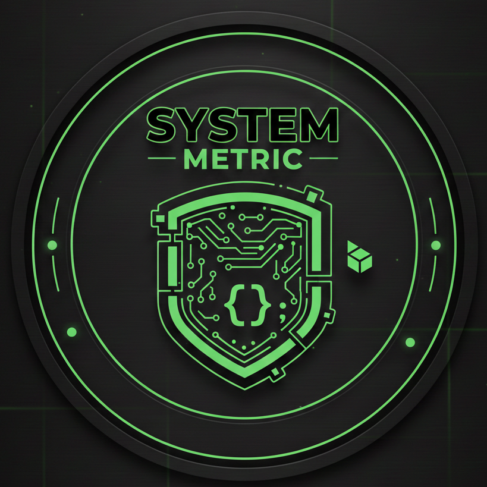

<div style="display: flex; align-items: center; justify-content: center; gap: 10px;">
  
  <h1 style="margin: 0;">system-metrics</h1>
</div>


## Architecture

- Qt (C++) desktop client
- FastAPI backend service
- Redis for live-state caching
- SQLite/PostgreSQL for persistence
- Low-level C collectors

## Quick Start

### 1. Start Backend Services

```bash
sudo docker-compose up -d
```

**Note for GPU Monitoring:** For GPU metrics collection with NVIDIA GPUs on Linux, ensure you have the [NVIDIA Container Toolkit](https://docs.nvidia.com/datacenter/cloud-native/container-toolkit/latest/install-guide.html) installed on your host system. This allows Docker containers to access your host's GPU resources.

Verify backend is running:
```bash
curl http://localhost:8000/api/v1/health
```

### 2. Build Qt Client

**Install Dependencies:**
```bash
# Ubuntu/Debian
sudo apt-get install qt6-base-dev qt6-charts-dev qt6-tools-dev cmake build-essential
```

**Build:**
```bash
cd client
mkdir -p build && cd build
cmake ..
make
```

### 3. Run Qt Client

```bash
./system-metrics-client
```

**In the client:**
1. Default URL is `http://localhost:8000`
2. Click **"Connect"** to fetch data
3. Click **"Start Auto-Refresh"** for live updates (5s interval)
4. Switch between **"Metrics"** and **"Logs"** tabs

## Features

- **Real-time Metrics**: CPU, memory, disk, network monitoring
- **Log Viewer**: Filterable system logs with pagination
- **Modern UI**: Dark theme with green accents and smooth animations
- **Auto-refresh**: Configurable live data updates
- **Cross-platform**: Linux, macOS, Windows support

## Documentation

- [API Documentation](docs/api.md) - REST API endpoints
- [Setup Guide](docs/setup.md) - Docker setup and testing
- [C Collector](docs/collector.md) - C metrics collector and backend integration
- [Qt Client](docs/client.md) - Client dependencies and usage

## Configuration

The backend service can be configured using the following environment variables. These should typically be set in a `.env` file in the `backend/` directory or as Docker environment variables.

| Environment Variable          | Default Value                     | Description                                            |
| :---------------------------- | :-------------------------------- | :----------------------------------------------------- |
| `POSTGRES_DB`                 | `system_metrics`                  | PostgreSQL database name (used internally by Docker).  |
| `POSTGRES_USER`               | `user`                            | PostgreSQL database user (used internally by Docker).  |
| `POSTGRES_PASSWORD`           | `password`                        | PostgreSQL database password (used internally by Docker).|
| `DATABASE_URL`                | `postgresql://user:password@db:5432/system_metrics` | SQLAlchemy database connection URL. **Important: For production, this should be a strong, unique password and user.** |
| `REDIS_HOST`                  | `redis`                           | Hostname for the Redis server.                         |
| `REDIS_PORT`                  | `6379`                            | Port for the Redis server.                             |
| `REDIS_DB`                    | `0`                               | Redis database number.                                 |
| `CACHE_TTL`                   | `60`                              | Time-to-live (in seconds) for cached metrics.          |
| `SECRET_KEY`                  | `dev-secret-key-change-in-production` | Secret key for application security. **Change in production to a strong, random value.** |
| `METRICS_COLLECTION_INTERVAL` | `5`                               | Interval (in seconds) for metrics collection.          |
| `METRICS_RETENTION_DAYS`      | `30`                              | Number of days to retain historical metrics.           |
| `METRICS_COLLECTOR`           | `psutil`                          | Metrics collection method (`psutil` or `c-collector`). |
| `C_COLLECTOR_PATH`            | `None`                            | Absolute path to the C collector binary (if used).     |

## Project Structure

```
system-metrics/
├── backend/          # FastAPI backend service
├── client/           # Qt (C++) desktop client
├── collector-c/       # C metrics collector
├── docs/             # Documentation
└── docker-compose.yml # Docker orchestration
```

## 🤝 Contributing

Contributions are welcome! Please feel free to submit a pull request or open an issue.

## 📄 License

This project is licensed under the MIT License.

## 🎥 Demo